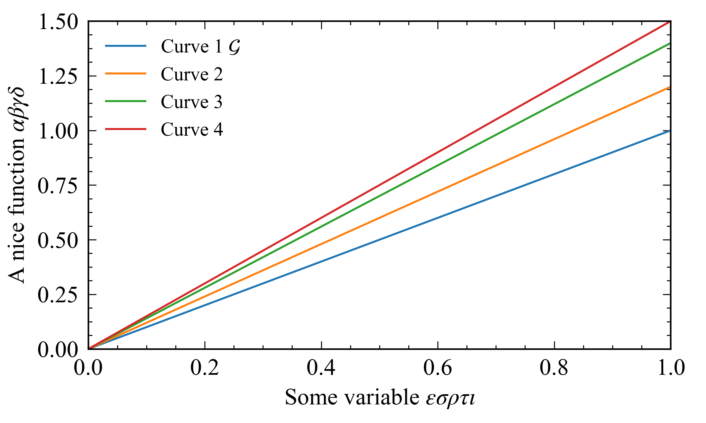

# mplstyle
A collection of customized [Matplotlib](http://matplotlib.org) styles sheets. 

For my own usage, but  might be of interest for someone else.

## Usage
At the begining of your `python`🐍 script add the following lines:

~~~~
import matplotlib.pyplot as plt
path = '~/Documents/FolderWhereYourStyleSheetIsLocated/
plt.style.use(path + 'timesnromanstyle.mplstyle')
~~~~

That's all. 😎

## Description of style sheets

1. `timesnromanstyle.mplstyle`: 
  * Font: uses the Times New Roman for both text and math; 
  * Color palette: uses the Matplotlib 2.1.0 defauls; 
  * Figure size: modified; (TODO: make width / heigth = golden ratio)
  * Ticks: changes length and width of both major and minor ticks; minor ticks 
  are always visible; ticks point inward the frame
  * Legend: changes default font size and removed frame.
  
2. `computermodernstyle.mplstyle`: 
 * Font: uses the default LaTeX Computer Modern font for both text and math; 
 * Color palette: uses the Matplotlib 2.1.0 defauls; 
 * Figure size: modified; (TODO: make width / heigth = golden ratio)
 * Ticks: changes length and width of both major and minor ticks; minor ticks 
 are always visible; ticks point inward the frame
 * Legend: changes default font size and removed frame. 
  
More to come soon.
 
## Example
See `usage_example.py` file for a minimal example.

The examples below show: (a) the default Matplotlib 2.1.0 plotting style, 
(b) using timesnromanstyle.mplstyle and (b) using computermodernstyle.mplstyle.
Warning: computermodernstyle.mplstyle uses "text.usetex: True", hence it runs 
it might take longer than normal to generate the output.

(`Default`)


(`timesnromanstyle.mplstyle`)


(`computermodernstyle.mplstyle`)


## Color cycle example

### Waseda color cycle
Here is a color cycle based on color scheme used 
in [Waseda University](https://www.waseda.jp/top/en)'s website. It's quite nice. To use it, add

```python
from cycler import cycler
# Waseda colors
wred = '#920527'
wblk = '#252427'
wblu = '#094C90'
wgra = '#757A7D'
wgrn = '#81990B'
wbrw = '#714D2A'
wyel = '#FDD003'
worg = '#D08B16'
wcya = '#02A0DA'
plt.rc('axes', prop_cycle=(cycler('color', [wblk, wred, wblu, wgra, wgrn, wbrw, wyel, worg, wcya])))
```

to your script. Here is an example:

(`Waseda color cycle`)


### Mathematica color cycle

Here is a color cycle based om `Mathematica 10`. See [here](https://mathematica.stackexchange.com/questions/54629/what-are-the-standard-colors-for-plots-in-mathematica-10) for how to get the RGB color code for Mathematica's default palette.

Add the following,

```python
from cycler import cycler
# Mathematica colours
colour_01 = (0.368417, 0.506779, 0.709798)
colour_02 = (0.880722, 0.611041, 0.142051)
colour_03 = (0.560181, 0.691569, 0.194885)
colour_04 = (0.922526, 0.385626, 0.209179)
colour_05 = (0.528488, 0.470624, 0.701351)
colour_06 = (0.772079, 0.431554, 0.102387)
colour_07 = (0.363898, 0.618501, 0.782349)
colour_08 = (1, 0.75, 0)
colour_09 = (0.647624, 0.37816, 0.614037)
plt.rc('axes', prop_cycle=(cycler('color', [colour_01, colour_02, colour_03, colour_04, colour_05, colour_06, colour_07, colour_08, colour_09])))
```

to your script. Here is an example:

(`Mathematica color cycle`)


Here are the colors in hexadecimal format, if necessary,

```python
colour_01 = #5d81b4
colour_02 = #e09b24
colour_03 = #8eb031
colour_04 = #eb6235
colour_05 = #8678b2
colour_06 = #c46e1a
colour_07 = #5c9dc7
colour_08 = #ffbf00
colour_09 = #a5609c
```

## References
More details [here](https://matplotlib.org/users/customizing.html).
