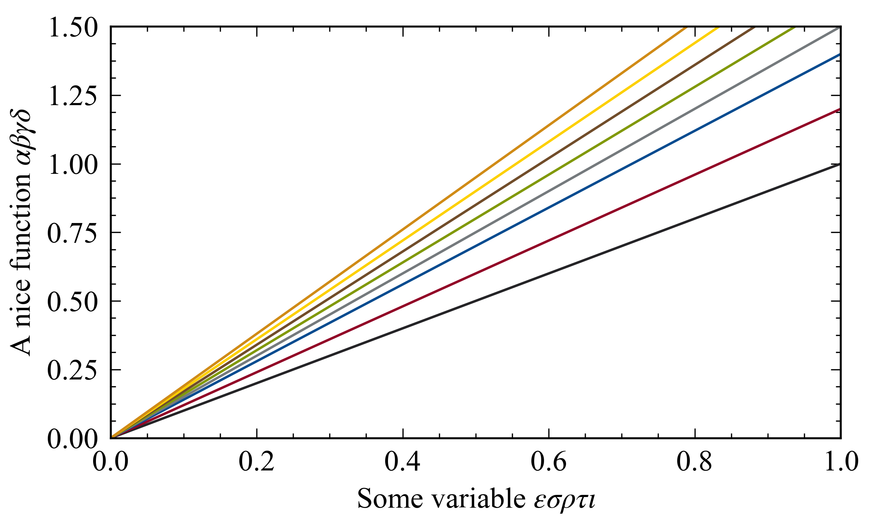

# mplstyle
A collection of customized [Matplotlib](http://matplotlib.org) styles sheets. 

For my own usage, but  might be of interest for someone else.

## Usage
At the begining of your `python`🐍 script add the following lines:

~~~~
import matplotlib.pyplot as plt
path = '~/Documents/FolderWhereYourStyleSheetIsLocated/
plt.style.use(path + 'timesnromanstyle.mplstyle')
~~~~

That's all. 😎

## Description of style sheets

1. `timesnromanstyle.mplstyle`: 
  * Font: uses the Times New Roman for both text and math; 
  * Color palette: uses the Matplotlib 2.1.0 defauls; 
  * Figure size: modified; (TODO: make width / heigth = golden ratio)
  * Ticks: changes length and width of both major and minor ticks; minor ticks 
  are always visible; ticks point inward the frame
  * Legend: changes default font size and removed frame.
  
2. `computermodernstyle.mplstyle`: 
 * Font: uses the default LaTeX Computer Modern font for both text and math; 
 * Color palette: uses the Matplotlib 2.1.0 defauls; 
 * Figure size: modified; (TODO: make width / heigth = golden ratio)
 * Ticks: changes length and width of both major and minor ticks; minor ticks 
 are always visible; ticks point inward the frame
 * Legend: changes default font size and removed frame. 
  
More to come soon.
 
## Example
See `usage_example.py` file for a minimal example.

The examples below show: (a) the default Matplotlib 2.1.0 plotting style, 
(b) using timesnromanstyle.mplstyle and (b) using computermodernstyle.mplstyle.
Warning: computermodernstyle.mplstyle uses "text.usetex: True", hence it runs 
it might take longer than normal to generate the output.

(`Default`)


(`timesnromanstyle.mplstyle`)


(`computermodernstyle.mplstyle`)


## Color cycle example

Here is a color cycle based on color scheme used 
in [Waseda University](https://www.waseda.jp/top/en)'s website. It's quite nice. To use it, add

```python
from cycler import cycler
# Waseda colors
wred = '#920527'
wblk = '#252427'
wblu = '#094C90'
wgra = '#757A7D'
wgrn = '#81990B'
wbrw = '#714D2A'
wyel = '#FDD003'
worg = '#D08B16'
wcya = '#02A0DA'
plt.rc('axes', prop_cycle=(cycler('color', [wblk, wred, wblu, wgra, wgrn, wbrw, wyel, worg, wcya])))
```

to your script. Here is an example:

(`Waseda color cycle`)


## References
More details [here](https://matplotlib.org/users/customizing.html).
